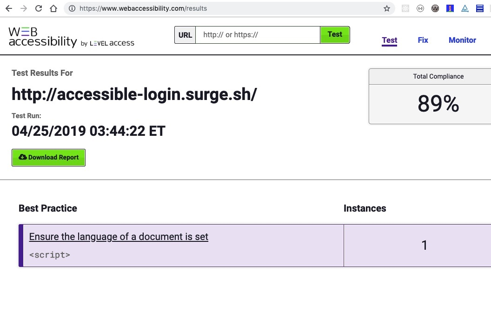

# simple-accessible-form
Create a simple HTML page which includes the following elements: 

* Login (heading)
* Username (label) Username textbox
* Password(label) Password textbox
* Login Button

 Please consider the following optional additions to the exercise. Keep accessibility in mind with regard to all aspects of the sample form.

# Client-side Validation
* Add constraint information for the password field (Ex: Password must include one capital letter, one lower case letter, and at least one number.)
* Check for the username “Level” and password of “Access123”.
* If successful, display an alert informing the user that there was a success. Also feel free to redirect to a page with text that says “You have signed in!”
* If unsuccessful, display an error notifying the user that the username/password combination was not recognized.

# Style the form
* Use custom explicit labels.
* Round the form field corners slightly.
* Place the form in a styled area of the page.
* Style the submit button

Feel free to use any libraries or frameworks with which you have experience. Also feel free to add more complex form fields to highlight more difficult implementations. 

# Testing
I tested accessibility compliance with the following tools:
* WAVE Accessibility Tool
* aXe Core 
* Web Accessibility by Level Access: https://www.webaccessibility.com 

# Deployment
* The login form has been deployed to the following site: http://accessible-login.surge.sh/ 

# Future Improvements
* add route/content to: http://accessible-login.surge.sh/login to confirm login success 
* Server-side validation
* Add passport authentication using JWT (which I have done for previous projects using MEHN and MERN stacks) so that: 
* When the user logs in, the backend creates a signed token and returns it in response
* The client saves the token locally (typically in localStorage) and sends it back in every subsequent request that needs authentication
* All requests needing authentication pass through a middleware that checks the provided token and allows the request only if the token is verified

# Requested Feedback/Questions
The site containing the login form I created passed the wave accessibility and axe tests. However, when running a test using Level Access's Web Accessibility testing tool, I ran into the following issue, despite having the language set with the lang html tag and within the the script tag (script language="javascript"). See below screenshot. How would I go about "ensuring the language of a document is set" when the language of the document has been already set? 

 